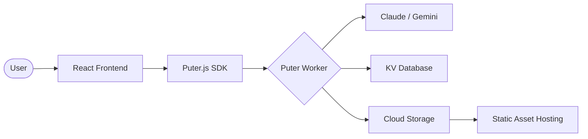

<div align="center">
  <br />
  <h1>⚡ RoomiFY ⚡</h1>
  <h3><b>The Architectural Visualization Powerhouse</b></h3>
  <p><i>Transcending 2D sketches into Photorealistic 3D Realities using Sovereign AI.</i></p>

  <br />

  
  
  
  
  <br />
  
  
  

  <br />
  <br />
  <hr />
</div>

## 📸 Visual Preview

| Step 1: 2D Architectural Blueprint | Step 2: Photorealistic 3D Visualization |
| :---: | :---: |
|  | 
 |


---

## 📖 Overview

**Roomify** is a premium architectural visualization SaaS that leverages cutting-edge AI to bridge the gap between abstract floor plans and tangible space. Designed for architects, real estate developers, and homeowners, Roomify turns flat 2D images into stunning, textured, and lit 3D architectural renders in a matter of seconds.

Powered by the **Puter Cloud OS**, Roomify provides a serverless environment for high-speed rendering, permanent asset hosting, and a collaborative community hub.

---

## 🚀 Key Highlights

| | |
| :--- | :--- |
| **✨ AI-Driven Rendering** | Uses Claude 3.5 & Gemini 2.0 to interpret architectural intent and generate photorealistic textures. |
| **☁️ Serverless Core** | Built on Puter Workers for globally distributed, zero-latency logic execution. |
| **📦 Permanent Hosting** | Every project is automatically hosted with a dedicated CDN URL for instant sharing. |
| **🛠️ Interactive Visualizer** | A custom-built 2D/3D comparison tool with high-performance metadata tracking. |
| **🌍 Community Feed** | A global showcase where designs can be discovered, shared, and toggled for privacy. |

---

## 🏗️ Technical Architecture

Roomify follows a modern, distributed architecture to ensure maximum performance and scalability:



---

## 🛠️ Tech Stack

### Frontend & Language
- **React 18**: Component-based UI for a fluid user experience.
- **TypeScript**: Ensuring type-safety and robust code architecture.
- **Tailwind CSS**: Utility-first styling for a premium, editorial aesthetic.

### Cloud & AI Infrastructure
- **Puter Cloud OS**: The "Internet OS" providing the entire backend suite (KV, Hosting, Workers).
- **Claude 3.5 Sonnet**: Used for complex architectural reasoning and image prompt engineering.
- **Gemini 2.0 Flash**: Powers the high-speed image generation and 2D-to-3D transformation logic.

---

## 🤸 Quick Start

Follow these steps to deploy your own instance of Roomify.

### 1. Prerequisites
- **Node.js** (v20 or higher)
- **npm** or **bun**
- A free account on [Puter.com](https://puter.com)

### 2. Setup
```bash
# Clone the repository
git clone https://github.com/Mohamed-Alkafory/roomiFY.git

# Install dependencies
npm install
```

### 3. Environment Configuration
Create a `.env.local` file in your root:
```env
VITE_PUTER_WORKER_URL="https://your-worker-name.puter.work"
```

### 4. Launch
```bash
npm run dev
```

---

## 🔑 Configuration Reference

| Variable | Required | Description |
| :--- | :--- | :--- |
| `VITE_PUTER_WORKER_URL` | Yes | The base URL of your deployed Puter Worker endpoint. |

---

## 🤝 Contributing

We welcome contributions! If you're interested in improving Roomify, please feel free to:
1. Fork the project.
2. Create your Feature Branch (`git checkout -b feature/AmazingFeature`).
3. Commit your Changes (`git commit -m 'Add some AmazingFeature'`).
4. Push to the Branch (`git push origin feature/AmazingFeature`).
5. Open a Pull Request.

---

<div align="center">
  <p>Created with passion for architectural innovation.</p>
  
  
</div>
